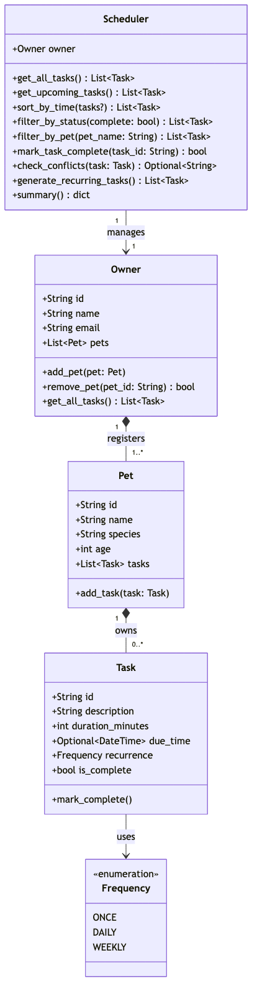

# 🐾 PawPal+

**PawPal+** is a Streamlit app that helps busy pet owners plan, track, and schedule daily care tasks across multiple pets — with smart conflict detection, chronological sorting, and automatic recurring reminders.

---

## 📸 Demo

**Adding a pet** — register pets by name, species, and age; all registered pets are listed instantly below the form.

<a href="img/Screenshot 2026-03-30 at 1.41.19 AM.png" target="_blank">
  
</a>

**Adding a task** — assign a care task to any pet with duration, recurrence, and an optional due date/time. A green success banner confirms the task was saved; a yellow warning banner appears instead if the time window conflicts with an existing task.

<a href="img/Screenshot 2026-03-30 at 1.41.23 AM.png" target="_blank">
  
</a>

**Schedule dashboard** — summary metrics, filter-by-pet and filter-by-status dropdowns, a sorted `st.table` showing all tasks, and one-click Mark Complete buttons for every pending task.

<a href="img/Screenshot 2026-03-30 at 1.41.25 AM.png" target="_blank">
  
</a>

---

## ✨ Features

### Pet & Owner Management
- Register an owner profile (name, email) that persists across the session.
- Add multiple pets with name, species, and age — each with their own independent task list.

### Task Creation with Conflict Detection
- Create care tasks (walks, feeding, medication, grooming, enrichment, etc.) with a description, duration, recurrence, and optional due date/time.
- **Conflict detection** — before a task is saved, `Scheduler.check_conflicts()` uses interval-overlap arithmetic to scan all existing tasks. If the new task's time window overlaps any existing window, a `st.warning` banner immediately names both conflicting tasks, their exact time ranges, and the affected pet — so the owner can reschedule rather than accidentally double-book.

### Smart Scheduling Algorithms
- **Sorting by time** — `Scheduler.sort_by_time()` orders tasks by `due_time` ascending. Tasks without a due time sort to the very end so urgent items always surface first.
- **Filter by pet** — `Scheduler.filter_by_pet(name)` scopes the schedule view to a single pet, making per-pet daily plans easy to read.
- **Filter by status** — `Scheduler.filter_by_status(complete)` returns only pending or completed tasks, letting owners quickly see what still needs to be done today.

### Automatic Recurring Tasks
- **Daily recurrence** — completing a `DAILY` task automatically schedules the next occurrence exactly 24 hours later.
- **Weekly recurrence** — completing a `WEEKLY` task schedules the next occurrence exactly 7 days later.
- One-off (`ONCE`) tasks are marked done without spawning a follow-up.

### Schedule Dashboard
- Summary metrics (total pets, pending tasks, completed tasks) rendered as `st.metric` cards.
- Filtered and sorted task list displayed in a clean `st.table` with columns for Pet, Task, Duration, Due, Recurrence, and Status.
- One-click **Mark Complete** buttons per pending task; the UI refreshes immediately and confirms any auto-scheduled recurrence.

---

## 🏗️ Architecture

```
pawpal_system.py   — data model and scheduling logic (Owner, Pet, Task, Scheduler, Frequency)
app.py             — Streamlit UI; reads/writes only through Scheduler methods
tests/             — pytest suite covering sorting, conflict detection, and recurrence
class_diagram.md   — up-to-date Mermaid UML class diagram
uml_final.png      — rendered UML diagram (final state)
```

### Class relationships

| Class | Owns / Uses |
|---|---|
| `Owner` | holds `List[Pet]`; provides `get_all_tasks()` |
| `Pet` | holds `List[Task]`; owned by `Owner` |
| `Task` | uses `Frequency` enum; owned by `Pet` |
| `Scheduler` | holds one `Owner`; all scheduling logic lives here |
| `Frequency` | enum — `ONCE`, `DAILY`, `WEEKLY` |

See [class_diagram.md](class_diagram.md) or [uml_final.png](uml_final.png) for the full diagram.

---

## 🧪 Tests

```bash
PYTHONPATH=. python -m pytest tests/test_pawpal.py -v
```

| Test | Behavior verified |
|---|---|
| `test_mark_complete_changes_status` | `Task.mark_complete()` flips `is_complete` to `True` |
| `test_add_task_increases_pet_task_count` | `Pet.add_task()` appends to the pet's task list |
| `test_get_upcoming_tasks_sorted_chronologically` | `get_upcoming_tasks()` returns incomplete tasks in ascending due-time order, undated last |
| `test_mark_daily_task_complete_spawns_next_day` | Completing a `DAILY` task creates a new task due exactly 24 hours later |
| `test_mark_once_task_complete_does_not_spawn` | Completing a `ONCE` task does **not** create a follow-up |
| `test_check_conflicts_flags_overlapping_tasks` | `check_conflicts()` returns a warning string when windows overlap |
| `test_check_conflicts_no_warning_for_adjacent_tasks` | Back-to-back tasks (no gap, no overlap) do **not** trigger a warning |

**Confidence: ★★★★☆ (4/5)** — all 7 tests pass; edge cases around timezone-naive/aware datetimes and multi-pet simultaneous conflicts are not yet covered.

---

## 🚀 Getting Started

### Install dependencies

```bash
python -m venv .venv
source .venv/bin/activate        # Windows: .venv\Scripts\activate
pip install -r requirements.txt
```

### Run the app

```bash
streamlit run app.py
```

The app opens at `http://localhost:8501`.

---

## 📐 UML Diagram

The final class diagram reflects all methods built across every phase of development.


