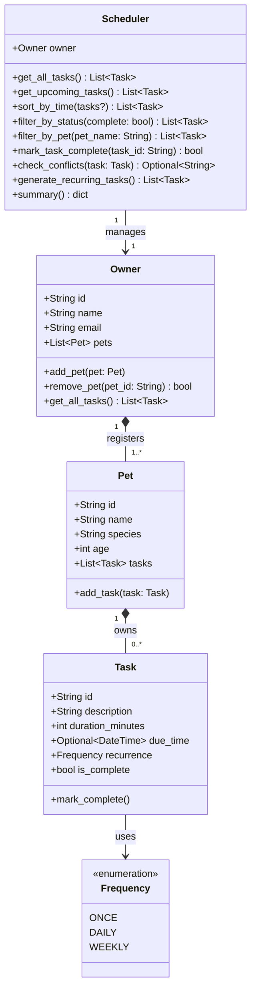

# PawPal+ Class Diagram

```mermaid
classDiagram
    class Frequency {
        <<enumeration>>
        ONCE
        DAILY
        WEEKLY
    }

    class Task {
        +String id
        +String description
        +int duration_minutes
        +Optional~DateTime~ due_time
        +Frequency recurrence
        +bool is_complete
        +mark_complete()
    }

    class Pet {
        +String id
        +String name
        +String species
        +int age
        +List~Task~ tasks
        +add_task(task: Task)
    }

    class Owner {
        +String id
        +String name
        +String email
        +List~Pet~ pets
        +add_pet(pet: Pet)
        +remove_pet(pet_id: String) bool
        +get_all_tasks() List~Task~
    }

    class Scheduler {
        +Owner owner
        +get_all_tasks() List~Task~
        +get_upcoming_tasks() List~Task~
        +sort_by_time(tasks?) List~Task~
        +filter_by_status(complete: bool) List~Task~
        +filter_by_pet(pet_name: String) List~Task~
        +mark_task_complete(task_id: String) bool
        +check_conflicts(task: Task) Optional~String~
        +generate_recurring_tasks() List~Task~
        +summary() dict
    }

    Task --> Frequency : uses
    Pet "1" *-- "0..*" Task : owns
    Owner "1" *-- "1..*" Pet : registers
    Scheduler "1" --> "1" Owner : manages
```
